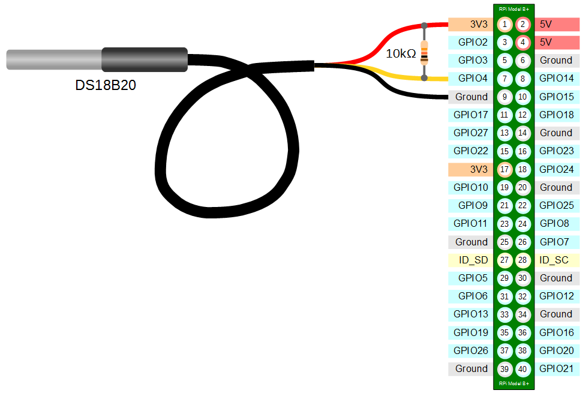

#Raspberrypi Weather station

## Connection




##How to run:

```
./gradlew bootRun
```

##system.d configuration (linux only)

```
echo "dtoverlay=w1-gpio" >> /boot/config.txt
sudo cp src/main/resources/weather.service /etc/systemd/system/weather.service
sudo systemctl daemon-reload
sudo systemctl enable weather.service
sudo systemctl start weather.service
```
